# HEX Chatbots System Architecture

This diagram represents the complete system architecture of the HEX Chatbot, including both the Admin and Uncle HEX interfaces, backend services, and external integrations.

```mermaid
%%{init: {
  'theme': 'base',
  'themeVariables': {
    'fontSize': '16px',
    'fontFamily': 'arial',
    'lineColor': '#2D3748',
    'primaryColor': '#4299E1',
    'primaryTextColor': '#1A202C',
    'primaryBorderColor': '#2B6CB0',
    'secondaryColor': '#63B3ED',
    'tertiaryColor': '#BEE3F8'
  }
}}%%

flowchart TB
    %% Same diagram structure but with improved styling
    subgraph Frontend["Next.js Frontend Application"]
        style Frontend fill:#E6F6FF,stroke:#3182CE,color:#2C5282,stroke-width:2px
        
        subgraph AdminInterface["Admin Chatbot Interface"]
            style AdminInterface fill:#EBF8FF,stroke:#2B6CB0,color:#2C5282
            AdminUI["Chat UI Component"]
            AdminForm["Message Input Form"]
            AdminHistory["Chat History State"]
            AdminState["React State Management"]
            AdminValidation["Input Validation"]
        end

        subgraph UncleInterface["Uncle HEX Interface"]
            style UncleInterface fill:#EBF8FF,stroke:#2B6CB0,color:#2C5282
            UncleUI["Chat UI Component"]
            UncleForm["Message Input Form"]
            FileUpload["File Upload Component"]
            FileSelect["File Selection Dropdown"]
            UncleHistory["Chat History State"]
            UncleState["React State Management"]
            FileValidation["File Type Validation"]
        end

        subgraph APIClients["API Client Layer"]
            style APIClients fill:#EBF8FF,stroke:#2B6CB0,color:#2C5282
            ChatAPIClient["Admin API Client
            - Error handling
            - Response formatting
            - State updates"]
            
            UncleAPIClient["Uncle HEX API Client
            - File handling
            - Error handling
            - Response formatting"]
        end
    end

    subgraph AWSInfra["AWS EC2 Infrastructure"]
        style AWSInfra fill:#FFF5F5,stroke:#C53030,color:#822727,stroke-width:2px
        
        subgraph DockerEnv["Docker Environment"]
            style DockerEnv fill:#F0FFF4,stroke:#2F855A,color:#22543D
            NGINX["NGINX Reverse Proxy
            - SSL termination
            - Request routing
            - Load balancing
            - Rate limiting"]
            
            subgraph FlaskBackend["Flask Backend Services"]
                style FlaskBackend fill:#F0FFF4,stroke:#2F855A,color:#22543D
                subgraph Endpoints["API Endpoints"]
                    style Endpoints fill:#F0FFF4,stroke:#2F855A,color:#22543D
                    AdminEndpoint["/api/chatbot
                    - Request validation
                    - Error handling"]
                    
                    UncleEndpoint["/api/uncle-hex
                    - File processing
                    - Request validation"]
                end
                
                subgraph AIAgents["AI Agent System"]
                    style AIAgents fill:#FAF5FF,stroke:#553C9A,color:#44337A
                    subgraph PidginAgent["Pidgin Admin Agent"]
                        style PidginAgent fill:#FAF5FF,stroke:#553C9A,color:#44337A
                        AdminPersona["Personality:
                        - Professional Pidgin
                        - HR expertise
                        - Portal knowledge"]
                        
                        AdminContext["Context Processing:
                        - Query analysis
                        - Database context
                        - Response formatting"]
                    end
                    
                    subgraph UncleAgent["Uncle HEX Agent"]
                        style UncleAgent fill:#FAF5FF,stroke:#553C9A,color:#44337A
                        UnclePersona["Personality:
                        - Clear Pidgin
                        - Data expertise
                        - Analytics focus"]
                        
                        UncleContext["Context Processing:
                        - Query analysis
                        - File analysis
                        - Data interpretation"]
                    end
                end
                
                subgraph DataProcessing["Data Processing Layer"]
                    style DataProcessing fill:#FFFAF0,stroke:#9C4221,color:#7B341E
                    ContextBuilder["Context Builder
                    - Database integration
                    - Context formatting
                    - Response templating"]
                    
                    FileProcessor["File Processor
                    - File validation
                    - Data extraction
                    - Format conversion"]
                    
                    AIHandler["AI Service Handler
                    - Prompt engineering
                    - Response processing
                    - Error handling"]
                end
            end
        end
    end

    subgraph ExternalServices["External Services"]
        style ExternalServices fill:#FFFFF0,stroke:#975A16,color:#744210,stroke-width:2px
        
        subgraph Firebase["Firebase Services"]
            style Firebase fill:#FFFFF0,stroke:#975A16,color:#744210
            DB["Realtime Database
            - Data storage
            - Real-time updates"]
            
            Storage["Cloud Storage
            - File storage
            - File retrieval"]
        end
        
        subgraph AI["AI Services"]
            style AI fill:#FFFFF0,stroke:#975A16,color:#744210
            GroqAI["Groq AI API
            - LLM processing
            - Response generation"]
        end
    end

    %% Frontend Flows - Thicker, darker arrows
    AdminForm --> AdminValidation
    AdminValidation --> AdminState
    AdminState --> AdminHistory
    AdminState --> ChatAPIClient

    UncleForm --> UncleState
    FileUpload --> FileValidation
    FileSelect --> FileValidation
    FileValidation --> UncleState
    UncleState --> UncleHistory
    UncleState --> UncleAPIClient

    %% API to Backend Flows
    ChatAPIClient -->|HTTPS| NGINX
    UncleAPIClient -->|HTTPS| NGINX
    NGINX --> AdminEndpoint
    NGINX --> UncleEndpoint

    %% Backend Processing Flows
    AdminEndpoint --> PidginAgent
    UncleEndpoint --> UncleAgent
    PidginAgent --> ContextBuilder
    UncleAgent --> ContextBuilder
    UncleAgent --> FileProcessor

    %% Data Processing Flows
    ContextBuilder --> AIHandler
    FileProcessor --> AIHandler
    FileProcessor -->|File Operations| Storage
    ContextBuilder -->|Data Queries| DB

    %% AI Processing Flows
    AIHandler -->|Prompt| GroqAI
    GroqAI -->|Response| AIHandler
    AIHandler --> PidginAgent
    AIHandler --> UncleAgent

    %% Response Flows
    PidginAgent --> AdminEndpoint
    UncleAgent --> UncleEndpoint
    AdminEndpoint --> NGINX
    UncleEndpoint --> NGINX
    NGINX --> ChatAPIClient
    NGINX --> UncleAPIClient
    ChatAPIClient --> AdminState
    UncleAPIClient --> UncleState

    linkStyle default stroke-width:2px,stroke:#2D3748,color:#1A202C
```

## System Components

### Frontend Application
- Admin Chatbot Interface for portal management
- Uncle HEX Interface for data analysis
- Shared API client layer

### Backend Services
- Flask server with specialized endpoints
- AI Agents for request processing
- Data and file handling

### Infrastructure
- AWS EC2 deployment
- Docker containerization
- NGINX reverse proxy

### External Services
- Firebase for data and file storage
- Groq AI for natural language processing
