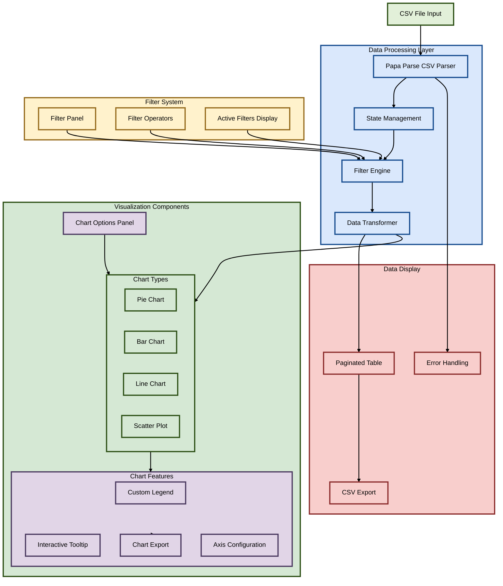

# HEX CSV Data Visualizer Architecture

## Component Details

### 1. File Input & Parsing
- CSV file validation
- Papa Parse integration
- Error handling
- File metadata tracking

### 2. Data Processing
- State management with React useState/useMemo
- Data filtering system with operators:
  - Equal/Not Equal
  - Greater/Less Than
  - Contains/Starts With/Ends With
- Data transformation for charts

### 3. Chart System
- Multiple chart types:
  - Pie Chart (distribution)
  - Bar Chart (comparison)
  - Line Chart (trends)
  - Scatter Plot (correlation)
- Features:
  - Custom legend with pagination
  - Interactive tooltips
  - Dynamic axis configuration
  - PNG export capability

### 4. Filter System
- Field selection
- Multiple operators
- Active filter display
- Filter removal

### 5. Data Display
- Paginated data table
- Filtered data export
- Loading states
- Error messaging

### 6. Features
- Real-time updates
- Responsive design
- Data validation
- Export capabilities

### 7. State Management
- React state hooks
- Memoized computations
- Callback handling
- Reference management

## Technical Implementation
- React with TypeScript
- Recharts for visualization
- Papa Parse for CSV handling
- Bootstrap for styling
- File API for exports

This architecture ensures:
1. Efficient data processing
2. Flexible visualization options
3. Robust filter system
4. Seamless user experience
5. Error handling
6. Export functionality